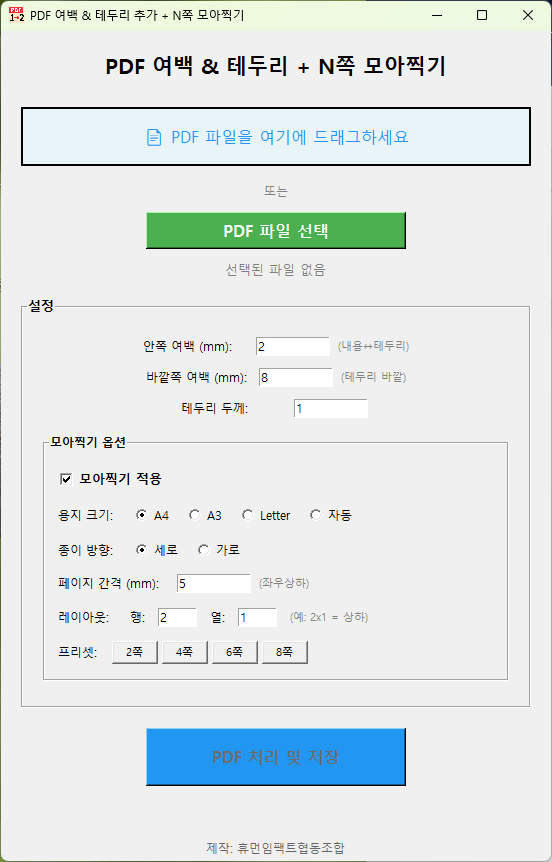

# pdf-nup-with-links

# PDF N-up Tool with Hyperlink Preservation

> 📚 **링크를 잃지 않고 PDF를 효율적으로 모아찍기**
> 
> 기존 PDF 모아찍기 도구들은 하이퍼링크를 제거하거나, 여백 조절이 불가능하거나, 중앙 정렬이 되지 않는 문제가 있습니다. 
> 이 도구는 **PDF 내부의 모든 하이퍼링크를 완벽히 보존**하면서도, 사용자 정의 여백과 테두리를 추가하고, 
> 2-8페이지를 한 장에 깔끔하게 모아찍을 수 있습니다.


## 💡 왜 이 도구가 필요한가요?

**일반적인 PDF 모아찍기 도구들의 문제점:**
- ❌ 하이퍼링크 손실, 보안 우려, 여백 및 테두리 조절 불가
- ❌ 보안 우려
- ❌ 여백, 테두리 조절 불가
- ❌ 중앙 정렬 없음

**이 도구의 해결책:**
- ✅ 모든 하이퍼링크 완벽 보존 (내부 링크, 외부 URL 모두)
- ✅ 안쪽/바깥쪽 여백 개별 설정
- ✅ 각 셀 중앙 자동 정렬
- ✅ 오프라인 작동 (개인정보 보호)
- ✅ 드래그앤드롭 간편 사용

## ✨ 주요 기능

### 🔗 하이퍼링크 보존 (핵심!)
- PDF 내부 페이지 링크 유지
- 외부 웹사이트 링크 유지
- 이메일, 파일 링크 등 모든 링크 타입 지원
- 좌표 자동 변환으로 정확한 클릭 영역 보장

### 📄 스마트 여백 & 테두리
- **안쪽 여백**: PDF 내용과 테두리 사이 간격 (기본 2mm)
- **바깥쪽 여백**: 테두리 바깥쪽 간격 (기본 8mm)
- **테두리 두께**: 조절 가능 (0으로 설정하면 테두리 없음)

### 📑 N-up 모아찍기 (2, 4, 6, 8쪽)
- **2쪽**: 세로 방향 상하 배치
- **4쪽**: 가로 방향 2×2 격자
- **6쪽**: 가로 방향 2×3 격자
- **8쪽**: 세로 방향 4×2 격자
- 커스텀 레이아웃 직접 설정 가능

### 📏 용지 크기 지원
- A4 (210×297mm)
- A3 (297×420mm)
- Letter (8.5×11 inch)
- 자동 크기 (원본 비율 유지)

### 🎯 자동 중앙 정렬
- 각 셀의 중앙에 페이지 배치
- 페이지 간격 조절 가능 (기본 5mm)
- 홀수 페이지도 깔끔하게 정렬

### 🖱️ 사용자 친화적 인터페이스
- 드래그앤드롭으로 파일 선택
- 원본 파일 위치에 자동 저장 제안
- 실시간 처리 상태 표시
- 프리셋 버튼으로 빠른 설정

## 🖥️ 스크린샷



## 📦 설치 방법(윈도우)

### 1️⃣ Python 설치

1. [https://www.python.org/downloads/](https://www.python.org/downloads/) 접속
2. "Download Python" 클릭
3. 설치 시 **"Add Python to PATH"** 반드시 체크 ✅
4. 설치 완료

### 2️⃣ 프로그램 다운로드

1. GitHub에서 "Code" → "Download ZIP" 클릭
2. 압축 풀기
3. 폴더를 `C:\pdf-tool` 같은 곳에 이동 (한글 경로 피하기)

### 3️⃣ 라이브러리 설치 (한 번만!)

**명령 프롬프트** 열기:
- 폴더에서 주소창에 `cmd` 입력 후 Enter

```
pip install -r requirements.txt
```

⏳ 2~3분 기다리기... 끝!

### 4️⃣ 실행

```
python pdf_margin_tool.py
```

완료! 🎉

---

### 🔧 EXE 파일 만들기 (선택사항)

#### 단계 1: PyInstaller 설치

```
pip install pyinstaller
```

#### 단계 2: EXE 빌드

```
pyinstaller --onefile --noconsole --icon=icon.ico --add-data "icon.png;." --name "PDF모아찍기" pdf_margin_tool.py
```

완성된 파일: `dist\PDF모아찍기.exe`

---

### ❓ 문제 해결

#### "python 명령어를 찾을 수 없습니다"
→ Python 재설치 시 "Add Python to PATH" 체크

#### "pip 명령어를 찾을 수 없습니다"
→ 대신 사용:
```
python -m pip install -r requirements.txt
```

#### 그래도 안 되면
→ [Issues](https://github.com/yourusername/pdf-nup-with-links/issues)에 질문하기

---

### 💡 3줄 요약

1. Python 설치 (PATH 체크!)
2. `pip install -r requirements.txt`
3. `python pdf_margin_tool.py`

끝! 🎊
